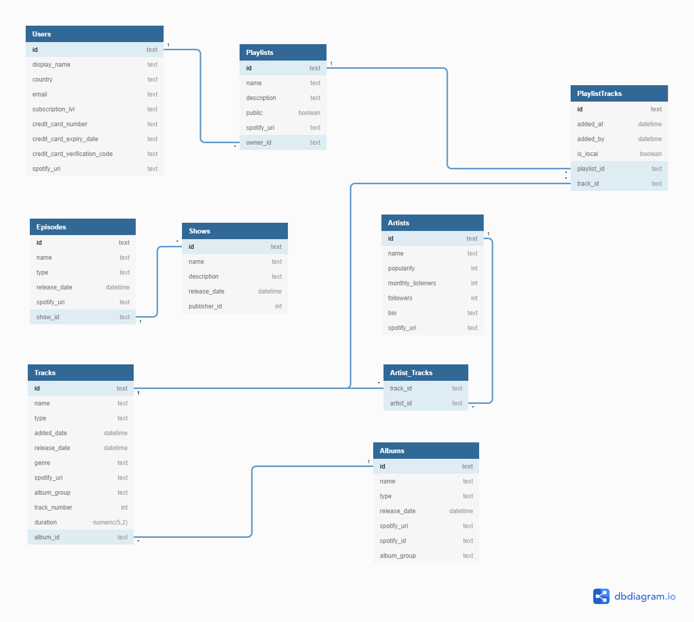
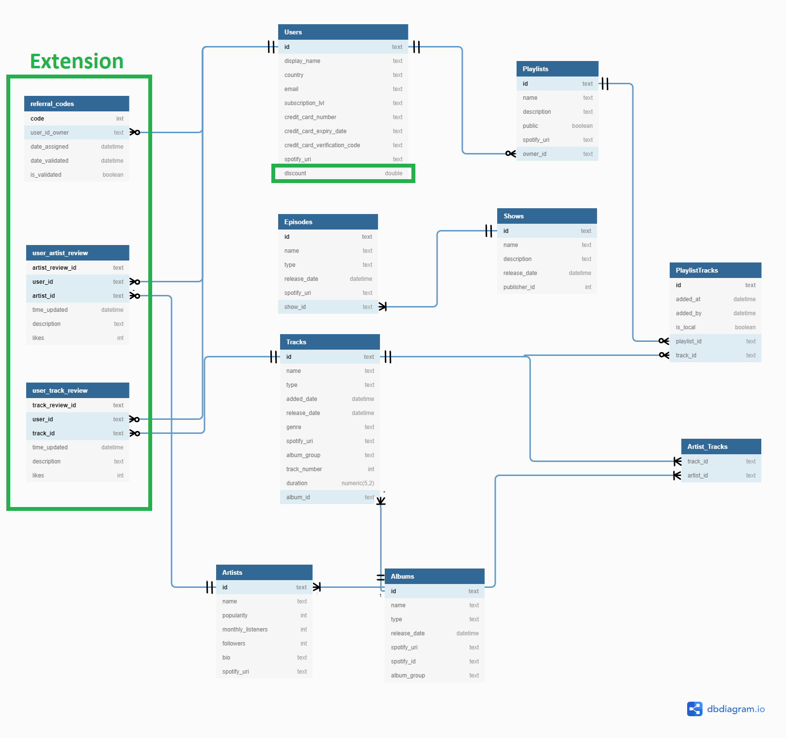
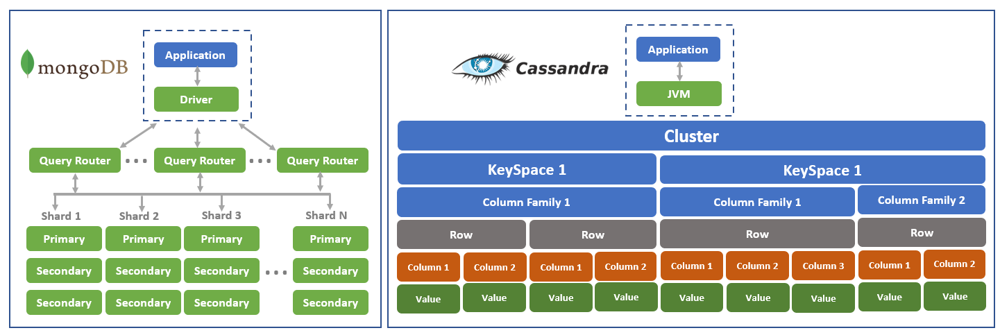

# Question 1

I have always been interested in Application Stacks and I have always admired one particular organisation: **Airbnb** and the way they:

- Seamlessly allow millions of users from over 81,000 cities to rent out their homes to other people who are looking for accommodation

* Allow users to invite other friends to see the same places they are looking to book
* Use Machine Learning algorithms to predict accommodation prices and personalise recommendations to each user

### Presentation Layer
- **ReactJS**

  This advanced JavaScript library is for creating UIs like that of Airbnb. 
  It provides great rendering performance which improves the user experience. It does this by eliminating the usage of code-heavy frameworks and implements reusable code. It shows visually by using the browser on a users device and asks the API for information.

- **React Native **

  This technology is used for mobile app development. It is platform agnostic so Airbnb can leverage all of its engineers to build and support their mobile app and it can be deployed in both iOS in Android code bases.
  Its also lean because the one repository can be deployed across all mobile platforms.
  
  It talks to the same API as ReactJS to retrieve information to display to the user. This is the case because it communicates with a single source of truth which can be displayed on multiple devices.
  
  

### Business/Application Layer

- **Ruby on Rails**

  Airbnb uses this web-application framework for database-backed web applications. It deals well with HTTP requests and scales horizontally very well. It is highly likely to be in API mode. It just sends JSON so that the ReactJS can present the view to users with Javascript.

  

  Ruby on Rails uses **convention over configuration**. It uses default structures for web pages, databases and web services. Conventions speed up the development process and it is possible to create great applications without knowing the conventions already in place.  These conventions help you skip making mundane decisions and make faster progress in the areas of the application which really matter.

  Additionally, Ruby on Rails promotes the use of the MVC pattern for its applications by storing code for each element as sperate files in separate directories. MVC separates the application into:

  **Models** for handling data and business logic

  **Controllers** for handling the UI and application

  **Views** for handling graphical UI objects and presentation

  Separating the application into these three distinct components helps improve scalability, easily maintain components and easily reuse model over multiple views.

  Scalability is important for Airbnb are they have an ever increasing number of users on their platform as well as a large number of features. Moreover, decoupling the components so that they have low dependency on each other, is crucial for Airbnb developers to be able to effectively maintain them. In effect this means that bug fixes made by Airbnb developers on one piece of functionality should not then affect another piece of functionality.

  

- **Nginx**

  This is a web server that Airbnb uses to provide services in conjunction with Ruby on Rails. It speeds up content delivery by using a proxy server. This proxy server ensures Airbnb's security and scalability. Additionally, Nginx can load balance, allows for both reverse and mail proxy, and can handle static files, index files and auto-indexing. 

### Data Access Layer

- **MYSQL**

  Airbnb uses MySQL to manage core business data. The databases are broken down by application which allows for easy capacity planning.
  Users' messaging threads and calendar listings are stored separately to the core booking flow data. They are managed in their own separate databases.

- **AWS ELB and Cloud Watch**

  Within this, Airbnb uses Elastic Load Balancing to automatically distribute incoming traffic between EC2 instances. This allows for Airbnb's system to still perform well even during sudden traffic spikes or unexpected traffic fluctuations. Furthermore, to monitor their servers and their resources, Airbnb uses Amazon CloudWatch. CloudWatch collects the operational data in the form of logs, metrics and events. Moreover, it allows supervision of EC2 assets via the Amazon Management Console. This is made up of automated dashboards which gives Airbnb an overall view of their resources, applications and services on AWS.
  
- **Redis**

  This is a no SQL scalable, key-value pair database that Airbnb uses. It allows Airbnb to store cache infrastructure which is transient and needs to be served up fast to users of the site. This reduces latency which improves the user experience on Airbnb's website.

* **Amazon RDS** 
  
  This helps to simplify time consuming administration tasks associated with databases. Difficult procedures that Airbnb does such as replication and scaling can be easily completed with a basic API call or through the AWS management console. Airbnb further uses Multiple Available Zones to automate database replication and augment data durability. These multiple available zones ensure that the Airbnb site almost never goes down and user data is backed up in case of system failure.

### References:
https://www.forbes.com/sites/quora/2018/02/20/what-technology-stack-does-airbnb-use/?sh=9eeb2484025c
https://yalantis.com/blog/the_technology_stack_behind_airbnb/
https://medium.com/@poojaseenu1999/the-technology-stack-behind-airbnb-6b23fe425612
https://dev.to/tyler032/tech-stack-to-build-marketplaces-like-airbnb-1ne1
https://softwareengineeringdaily.com/2018/09/24/show-summary-react-native-at-airbnb/
https://enqueuezero.com/airbnb-architecture.html
https://hub.packtpub.com/what-software-stack-does-airbnb-use/
https://medium.com/airbnb-engineering/unlocking-horizontal-scalability-in-our-web-serving-tier-d907449cdbcf

https://medium.com/@dezwhatiwant/ruby-on-rails-convention-over-configuration-1a09534d8e3c

https://www.sitepoint.com/model-view-controller-mvc-architecture-rails/

# Question 2

Airbnb collects data from millions of users over the world and has fluctuations in demand due to the different holiday seasons.
The data comes from both those looking for rental accommodation as well as those trying to rent their property.
Users can use Airbnb both from their computer or from mobile devices such as iOS and Android.
Clearly, Airbnb has a lot of data from multiple sources to both store and analyse and the following paragraphs summarise the technologies used by Airbnb to effectively manage their user data.

The **Hadoop Distributed File System (HDFS)** is what Airbnb uses this as their core data platform the drives the site and their analytics. 
Airbnb stores unstructured data such as room info, room owners, locations of the room etc. 
Hadoop is a framework for stores and processing this big data. It split data into chunks and saves across many servers. It also uses the MapReduce algorithm which allows for processing and generating big data sets in a parallel manner. 
The name MapReduce comes from reading data into a database, mapping it for analysis and performing maths operations to reduce it. This is what is done to bigdata in Hadoop.
Airbnb uses Hadoop to store users data across large files and replicates their data across multiple hosts to achieve reliable information retrieval.
In addition to the Hadoop File System, Airbnb has a data warehouse that uses Hive. Airbnb has over 1.5 petabytes of data in Hive-managed tables within its Hadoop Distributed File System which is hosted on EC2 instances.

Another technology used by Airbnb is S3 or **Simple Storage Service** which is a service offered by AWS. Airbnb has millions of photos to store from its users. They are important as they show off the accommodations that are available for rent. Airbnb stores its images for its website in S3 and stores backup data in Hadoop clusters along with using the Presto SQL query engine.
**Presto** is a high performance and distributed query engine. It treats the entire database cluster as a single, logical SQL database. It can use multiple servers for querying so that no single server becomes a bottleneck. Airbnb uses this to combine data from multiple sources and to allow analytics to be performed across the entire organisation.

The **Presto query** is critical for many of Airbnb's features. For example, Airbnb price feature continuously tells hosts what the probability is of them getting a booking at the price they have chosen. Hosts can see what dates are likely sold out and the current price offering and which ones are not. 

Airbnb has created a tool called **Airpal** so that it is easy for their employees to design SQL queries and dispatch them to the Presto layer of the data warehouse. This enables employees without SQL knowledge to still effectively query the Airbnb data warehouse for information they need.

A popular feature of Airbnb is its price recommendation. The engine behind it pulls in over 5 billion training data points and trains a model to predict the price of a listing depending on various factors like the neighbourhood, house size etc.
The machine learning package that Airbnb uses for this is **Aerosolve** and was built by their own data science team.
The package can be used to produce models based on conditional probability. These models can be used to explain why certain listings command higher prices, along with predicting home values and detecting host's preferences. These models also help deliver great insights to the hosts and help users find suitable accommodation that satisfies their preferences.

https://www.dezyre.com/article/how-data-science-increased-airbnbs-valuation-to-25-5-bn/199
https://medium.com/airbnb-engineering/using-chatbots-to-provide-faster-covid-19-community-support-567c97c5c1c9

https://www.nextplatform.com/2015/09/10/airbnb-shares-the-keys-to-its-infrastructure/#:~:text=The%20core%20data%20platform%20employed,the%20Hadoop%20Distributed%20File%20System.&text=On%20top%20of%20the%20HDFS,and%20open%20sourced%20by%20Facebook.
https://www.nextplatform.com/2015/09/10/airbnb-shares-the-keys-to-its-infrastructure/

# Question 3
### Hardware and cloud platforms that are used by **Airbnb**:

**5000 AWS EC2 instances**. They are all **3.8xlarge machines** and are each backed up by **3 Terabytes of Elastic Block Storage**. All of the **Hadoop Data File System** data is stored in this mounted EBS. Airbnb holds around **1.5 petabytes of data** in their Hive-managed tables in Hadoop Distributed File System clusters. Of the 5,000 instances, 1,500 of the EC2 instances are deployed for the web-facing parts of the applications and the remaining 3,500 for analytics and ML algorithms. There are many millions of users and hosts on Airbnb with their own set of data points. Therefore the greater number of EC2 instances dedicated to analytics and ML algorithms makes sense given the plethora of data available for optimising Airbnb's ML models. Amongst other important goals, these models attempt to predict home values on Airbnb and recommend personalised listings for each user.  

**AWS Elastic Load Balancing** is used by Airbnb to distribute the incoming traffic between multiple EC2 instances. This is to ensure that no individual EC2 instance is being overwhelmed with user requests and so that the performance of Airbnb does not degrade. This helps keeps the Airbnb site up and running with high availability.

**Simple Storage Service (S3)**. This service houses backup data and static files as objects. Airbnb uses this service to store over **10 terabytes** of user photos. Airbnb would chose object storage for images over block storage because parts of individual photos do not need to be edited. Also **retrieval of photos needs to be quick** which is an advantage of object storage over block storage. **Block storage is slow for retrieving data** because it is broken down into pieces called blocks and putting all the blocks back together every time it is retrieved can take time. On the other hand, Object storage with AWS S3 allows for fast and easy access to files because **object storage doesn't split up files**. Instead, the object's data is stored in the one place.

**Amazon Elastic MapReduce** . This technology on the AWS cloud platform processes all of the data that Airbnb receives. It helps process and analyse **50 GB of data** daily in the AWS cloud. Specifically, the MapReduce framework breaks down the input data into smaller fragments or shards, that distribute it to the nodes that compose the cluster. This makes it easily to store all the data that Airbnb receives from its millions of users and hosts.

**Amazon CloudWatch**. This is a tool for supervising all of the EC2 assets from the AWS Management Console. It allows Airbnb to easily identify any performance bottlenecks. For example, if Airbnb can locate a server that is being overwhelmed with requests then they can **divert those requests** to servers with less load.

Additionally, **CloudWatch** provides 15 months of data retention. This historical data can be used to predict what level of usage there will be of Airbnb's CPU, memory, disk and network data. Airbnb experiences seasonal variation in usage with spikes during Summer time. It is therefore important to know how much more CPU, memory and network performance they need during these times so they can plan in advance for how much of each resource they will likely need.

#### References:

https://ngenioussolutions.com/blog/role-played-by-amazon-web-services-aws-in-growth-of-airbnb/
https://www.nextplatform.com/2015/09/10/airbnb-shares-the-keys-to-its-infrastructure/
https://medium.com/airbnb-engineering/data-infrastructure-at-airbnb-8adfb34f169c
https://medium.com/@abhiraj19000/aws-airbnb-case-study-43e34e9fb8b3
https://ngenioussolutions.com/blog/role-played-by-amazon-web-services-aws-in-growth-of-airbnb/

https://medium.com/cracking-the-data-science-interview/the-5-machine-learning-use-cases-that-optimize-your-airbnb-travel-experience-fb027a56e5a5

# Question 4

**Spotify** provides developers with a total of 13 different APIs. Three of the main APIs available are below:

1. **User Library API**
The endpoints in this API are for retrieving information about and managing tracks that a current user has saved in their *Your music*  library.
This API can be used to get, save and remove the albums, shows and tracks for the current user library. This is done by calling the API endpoint and providing the requests parameter and header fields.

2. **Playlists API**
This API allows playlists to be created by the user. In addition items can be added, removed and replaced in each of the playlists and the playlist can have a photo and details both added or removed.
These endpoints allow the user to customise their own playlist with their favourite songs.

3. **Playback API**
    This API gives functionality to the User's Playback. The User's Playback plays the user's tracks. In this playlist are a queue of items.
    The API allows you to play and pause the user's playback, repeat a track, seek to a position in a current track, shuffle or skip tracks, and many more different functionality. 

  

The following **entities** help to fulfill the functions of the organisation.

1. **Track**

The track entity stores the the details of the particular song. 
The API can retrieve attributes such as its name, duration, artist who created it, duration, album it is from, created at time and genre.
The track object in full contains a simplified album object, an array of simplified artist objects, its name and popularity, track number, available markets and its spotify URI.

2. **Episode**

The episode entity has all the details of a particular episode. This is so that the user can find out all the information about a particular episode they are interested in.
The objects includes information such as the eposide description, duration in milliseconds, an audio preview in mp3 format, images from the episode, the languages used in the episode, 
the show that the episode belongs to and the Spotify URI of the episode

3. **Album**

The album API allows developers to get information such as the artist's name who wrote the album, the album name, the markets its available in, the year it was released, images from the album and tracks on that album
The entity itself has information about the album such as the type of album, an array of simplified artist objects, an array of simplified track objects name, popularity, label, a release date and the spotify URI of the album.

4. **Artist**

The Artist API gives back information on the number of followers for that artist, the genres for the artist, images of their songs, their name and their popularity. 
The Artist entity itself contains the artists array of genres, an array of images of the artist, their number of followers, their name, popularity and Spotify URI.
Users can find an artists they like and listen to their songs on Spotify. They can also find links to their social media pages, a bio of the artist, how many people monthly listeners that artist has and where in the world those listeners are from.

5. **Playlist object**

The Playlist entity contains information about one of the user's playlists. Information it has include the name of the playlist, an array of up to three images for the playlists, an array of playlist track objects,
the Spotify URI of the playlist and an followers object which has info on the followers of the playlists. The playlist API can be used to retrieve, modify and even delete tracks from a user's playlist.
This object allows users to give a group of similar songs a name, images and added to that playlist.
Also the songs can be ordered which allows them to listen to each track in the order that they choose.

6. **Playlist track object.**

Playlist objects have their own playlist track objects within them. This allows a user to access particular tracks within their playlist. The playlist object stores a track or episode object but
also stores additional information which are the timestamp it was added at, who added it and whether the track or episode is local.

7. **User object (public)**

The entity contains information about a user that is publicly available. It has the user's display name, a followers object with information about their follows, the user's profile image
the user's id and their Spotify URI. This user object allows other users to see which artists their friends have been listening to as well as their public playlists.

8. **User object (private)**

The entity contains the private information about a user that only they and Spotify itself have access too. The private information includes information not in the public user object.
This includes the country of the user, their email address and their Spotify subscription level eg. "premium", "free".
This information is used by Spotify to check whether to charge a user (premium vs free), what shows they may like to see (country) and send promotional material and billing information to them
via their email address.

9. **Show object (full)**

Show object is the entity that stores show details. This is required so that users can find out information about a show such as the name, description and images of it.
Furthermore, if they are interested in the show they can access the array of episode objects and choose a particular episode that they would like to watch.

# Question 5

### Entity Relationship Diagram of Spotify

# Question 6

### First process 

https://api.spotify.com/v1/artists/{id}/top-tracks is Spotify's endpoint for retrieving the top tracks of an artist by country.
A user may wish to see what are the top tracks of one of their favourite artists in their home country. This API endpoint gives them that information.

The input data to the artist top tracks API endpoint is 
- a valid access token (**Header field**)
- the spotify id of the artist (**path parameter**)
- country to look at for the artist's top tracks (**query parameter**)

The output data from this endpoint are an array of track objects for the particular artist in the inputted country.
Each **track object** in the array has the following data:

**album** -  The album on which the track appears
**available_markets** - A list of the countries in which the track can be played
**duration_ms** - The track length in milliseconds
**explicit** - Whether or not the track has explicit lyrics
**name** - The name of the track.
**popularity** - A value between 0 and 100, with 100 being the most popular
**preview_url** - A link to a 30 second preview of the track

### Achieving Organisational Objectives:

This API endpoint helps users be entertained by listening to tracks from their favourite artists.
Spotify users can use this API endpoint to view all the top tracks of their favourite artists.
If they like, they can **find the most popular track of their favourite artist** and then **hear a 30 second preview** of the track to see if they like it.
The track objects also let users know **which album the track** is from in case the user wants to find out what other tracks are on that same Album.

Helping users navigate to tracks by their favourite helps **improve the experience** of users and encourages them to listen to more tracks and <u>**stay on the platform for longer**</u>.

The **more tracks** the user listens to, the **more advertisements** they will also listen too between those tracks.
The **more advertisements** they hear, the more likely the user will hear about a product or service they like that is being advertised to them.
This in turn makes Spotify more valuable for advertisers and **generate revenue**.

Also, if Users find the tracks they hear but really don't like listening to ads, then they may **pay a subscription to upgrade to a premium spotify account**.
This is another revenue stream for Spotify.

### Second process

https://api.spotify.com/v1/episodes/{id} is a Spotify endpoint for receiving information about a particular episode.
Each episode has a unique Spotify ID and that must be passed through as a path parameter.

Spotify users can use this API endpoint to get details on and view a particular episode that they are interested in.

The input data to the artist top tracks API endpoint is 
- a valid access token (**Header field**)
- the spotify id of the episode (**path parameter**)
- market within which to look for the episode (**query parameter**)

The output data from this endpoint is a single episode object which matches the id within the path.
The episode object has the following data:

**audio_preview_url** -  A link to a 30 second preview of the episode
**description** - A description of the episode.
**duration_ms** - The episode length in milliseconds
**explicit** - Whether or not the episode has explicit content
**name** - The name of the episode
**languages** - A list of the languages used in the episode
**release_date** - The date the episode was first released
**show** - The show on which the episode belongs

### Achieving Organisational Objectives:

Encouraging users to use **Spotify** more is critical for achieving the organisational objective of **generating revenue**.

This API endpoint helps users **get details about and watch their favourite episodes which encourages them to stay on the platform and watch it**. 
Additionally the API endpoint gives information about the show that the episode is from, so users can see the entire series of that show. <u>**Showing the series that the show comes from helps keep the user on the platform by showing the other episodes**</u>. The episode also has description so users can learn what the episode is about without having to watch it.

The **more users watch episodes, the more advertisements they will being watching** during those episodes.
This makes Spotify more valuable to advertisers and **generates higher advertiser revenue**.
Also users may think it worth removing the ads and instead decide to **upgrade to premium**.
This **generates revenue directly from Spotify users** and covers the cost of licensing the show and developing the Spotify software.

# Question 7

As a way to improve the data model, Spotify could implement the following extensions.

## Extentions 

- **Referral Discounts**
  If a Spotify user upgrades to a premium account, then they could be given a referral code to send to users friends. If a friend of theirs also upgrades to a premium Spotify account and enters in the referral code then they can receive a 15% discount on their subscription.
  Overall, this initiative can only improve the number of users who upgrade to premium. Some of the referred friends may have signed up anyway but overall it should improve revenue. Even if the friend doesn't sign up, it serves as free word-of-mouth advertising for Spotify. Both advertising and number of premium users help to achieve the organisational function of earning revenue.

  In addition, Spotify has very little expense increase per new premium user so referrals are more effective than compared to other products.
  For example, selling an extra car has direct material, manufacturing and labor costs attached to it. The product cost per car is at least a few hundred dollars.
  On the other hand, each new premium Spotify user has very little expense attached it. The cost of running the server and network stay the same.
  Only when millions of new users are added, will the cost of running Spotify's servers and networks need to increase and that is relatively negligible compared to the additional revenue from new users.
  Therefore the referral discount method should be very effective at improving the **organisational function of increasing the number of users listening to Spotify**.

- **Give reviews on tracks and artists**
  A Spotify user may be interested in knowing what other users think about a particular track or artist. Also a spotify user may want to like another users comment in order to express agreement with what they have said. 

  Allowing reviews would really help users to find out whether the track or artist is for them and once they find good reviews for a particular track or artist, they will be encouraged to listen to them
  Listening to more music will result in users listening to more advertisements. This makes Spotify advertising more valuable to potential advertisers.
  More advertising revenue would achieve the **organisational function of increasing overall revenue**.

### Additional entity:

- **referral_codes**
The important property of a referral code is their status. Their status should say whether it has been offered to a friend or not, and whether it has been used.
Once a referral code is used, it should no longer be valid.
Also referral codes should be unique and not null. This way there are no ambiguity in the database table about the status of a referral code.

- **user_track_reviews**
The track reviews should tell us when a particular user made their review on that track. Also the review should have likes attached it so that reviews can be ordered by most likes.

- **user_artist_reviews**

  The artist reviews should tell us when a particular user made their review on the particular artist. Also the review should have likes attached it so that reviews can be ordered by most likes.

### Additional relationships between entities:
- One user can send out multiple referral codes but a referral code belongs to only one user. This is a one-to-many relationship. Therefore **referral_code_owner** will be a foreign key in the **referral_codes table**.
  The foreign key **referral_code_owner** will be referencing to the id field of the **Users table**.
  Additionally a **discount rate column** will need to be added to the user entity so that Spotify knows to charge them at
  15% less than the usual amount.
- One user can have many tracks that they have listened too and a tracks can be listened to by many users. Therefore, the **user_track_reviews entity** will act as a join table between both users and tracks, and will hold statistics for how much the user listens to a particular tracks. 
- One user can listen to many artists and an artist can be listened to by many users. Therefore, the **user_artist_reviews entity** will also act as a join table between both users and tracks, and will hold statistics for how much the user listens to a particular tracks. 

### Additional inputs and processes:

- **Referral Discounts**

Spotify will need to generate unique referral code numbers and insert a very large number of them into the **referral_codes table**.
Once a user decides to refer a friend then this input from the user will be used to trigger the process of assigning them a unique referral code and changing the status of the referral code to pending. If the referred friend upgrades to premium then they have their user entity updated with membership status of 'premium' and discount rate of 15%. The referral code has now been validated and the **referral_codes table** must be updated so that the column **is_validated** becomes true.

- **Reviews on tracks and artists**

The **user_track_reviews ** table will have a column for the user, track, date and time of the review, the content of the review and the number of likes. Therefore, each time a track review is made by a user, the table must be updated with the all the details of the review.

Likewise, the **user_artist_reviews** table will have a column for the user, artist, date and time of the review, the content of the review and the number of likes. Therefore, each time an artist review is made by a user, the table must be updated with the all the details of the review.

# Question 8

### Entity Relationship Diagram of Spotify with the extensions added

# Question 9

### How the improvements will be supported technically

The extension will need to be supported by a team comprising of a Database Administrator, User-Interface developer, back-end developer and testers.

A **database administrator** is required to add two new tables in the database with the correct datatypes for each field and constraints. Additionally, they need to migrate the discount field into the Users table and write the CRUD operations needed to make changes to the **user_track_review**, **user_artist_review** and **users table**.

A **front-end developer** must create new graphics and text fields in the track and artists pages so that the user can write their own **review** beneath the relevant track or artist. Moreover, there must be a GUI for a user to interact with that assigns them a **referral code** when they request one. This referral code should be made available to them so they can send it to their friend. There also must be a place on the Spotify app where another user can validate the referral code they received from their friend.  

**Testers** are required to test out the feature as if they were indeed as user on the Spotify app. They should write test cases and check that it works successfully. Tests include making sure a user is able to request and receive a **referral code** as well as pass it on to another user. Furthermore, the other user should be able to validate it and receive a 15% discount on their subscription. Finally, it should be prohibited for a user to use the same referral code twice.

Additionally, testers should try adding in reviews for different artists and tracks, and have another tester like their reviews. The reviews should display the correct user who wrote it, the correct date and time that they wrote it and update the number of likes.

**Data Analysts** will need to look at how the changes are affecting revenue. For example, they would investigate what percentage of **referral codes** are being validated, how many more users are being added and what dollar value this adds to Spotify's premium user revenue. Moreover, they will need to report on the **reviews extension** and what they uptake is like. Statistics they should find include how many reviews are being made per user, how many new reviews are made each day per artist and per track. In addition, they should look into complaints made to Spotify and whether some are related to the new extensions. They should report on their findings to management so they have information on whether the new extensions are working well or need to be modified or scrapped.

### How the improvement will affect stakeholders who utilise the system

The referral code extension will allow users to send referral codes to friends so that they can receive a 15% discount if they upgrade to premium. This affects the user by reducing the cost of their premium membership by 15%.  

Spotify will need to inform users about this new extension and how to send the referral code to their friend. This will affect what a user sees on their Spotify app.

The extension should increase the number of premium Spotify users and the overall revenue Spotify receives. It also affects how Spotify will charge the referred premium users vs non-referred premium users.

For the reviews extension, this will very much alter what a user sees when they view an artist or track page. They should be able to see the most liked reviews and this will help inform them whether the artist or track is worth listening. A well liked positive review will affect the user by encouraging them to listen to the relevant track or artist.

### Additional costs that may be incurred to implement the improvement

The extensions will require more database tables and records to be written to them. Also there will be more CRUD operations required to keep the database records up to date. If this results in a very significant increase in the size of the database then Spotify may need to increase the size of their Amazon EC2 instance to accommodate for this new data. Also the network speed may deteriorate if may users are trying to write their own reviews. Therefore upgrading the network performance of the EC2 instances that Spotify uses is crucial. This will incur additional costs.

Also the technical support required from the team of front-end developers, back-end developers, database administrators and testers may result in more labour costs depending on how they are paid for their work.

# Question 10

### Alternative Solution 1

### Google Cloud Platform instead of AWS for compute services

- **Lower costs**: Google Cloud Platform offers comparable cloud computing services to AWS however GCP prides itself on its lower costs compared to its competitors. GCP has both Committed Use and Sustained Use Discount programs which enables significant price advantages over AWS for certain compute services. It proves price reductions the more a VM is used per month. 

  Spotify would need large amounts of data to store or analyse from its users. In this case, GCP storage prices are up to **20% cheaper than AWS** excluding archive storage. GCP leads the industry in AI and ML so Spotify could leverage their services. Also with GCP there is no need to reserve an instance for one to three years, unlike is the case with AWS. Additionally, GCP allows you to **create custom VMs** to avoid paying for unnecessary capacity. AWS does not allow this level of customisation for compute instances. Therefore GCP offers **cheaper** and **more flexible** VMs compared to AWS for many use cases.

- **Simple free-tier**: Google Cloud Platform has a $300 credit offer for new customers. Although a small amount  for large enterprises like Spotify, it does offer more flexibility in the services that Spotify can try. Moreover, GCP makes it simple with an always free-tier on 24 products and services, subject to consumption limits. AWS is more complicated as they have 30-day, 12-month and always-free periods depending on which service of theirs you use.

- **Projects vs Accounts**: Google Cloud Platform groups your service usage by projects. This way one account can have many different, separate projects. In an organisation setting, different divisions can have separate project spaces all in the one account. Once a project is finished it can be deleted and all the resources for that project are deleted. However, with AWS, it is more difficult. You need multiple user account and each account has a separate set of users. This is quite cumbersome since there are so many users. There are ways to connect the accounts so a user has across account permissions but it is a pain to setup and manage.

  

https://nandovillalba.medium.com/why-i-think-gcp-is-better-than-aws-ea78f9975bda

https://www.cloudhealthtech.com/blog/google-cloud-vs-aws

https://cloud.google.com/docs/compare/aws

### Alternative Solution 2

### MongoDB instead of Apache Cassandra for data storage

- **Expressive data storage**: MongoDB uses an object-orientated data model which easily supports data structure in the domain of the user. Data can be nested for multiple levels and have its own properties. **Cassandra is less flexible** as it has the traditional table structure of specific data type columns and rows. The structure of data must be defined when the tables are created. Also MongoDB allows the user to **alter the enforcement of database schema**. Instead, Cassandra doesn't offer this, it only provides **static typing** in which the column types must be defined at the beginning.

  Comparison of the two data models

  

  

  

- **Greater throughput**: According to the industry standard benchmark created by Yahoo! called YCSB, MongoDB provide greater performance compared to Cassandra. In all test cases, MongoDB outperformed Cassandra, whether in read dominant workloads or when balanced for throughput and durability. 

https://severalnines.com/database-blog/battle-nosql-databases-comparing-mongodb-cassandra